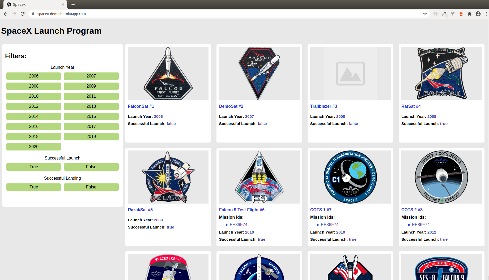
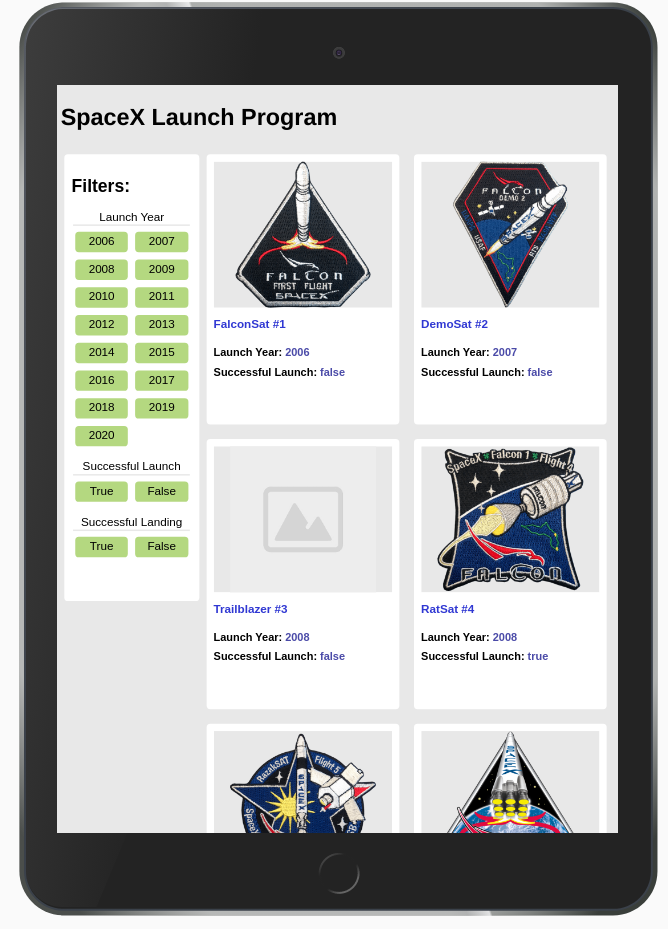
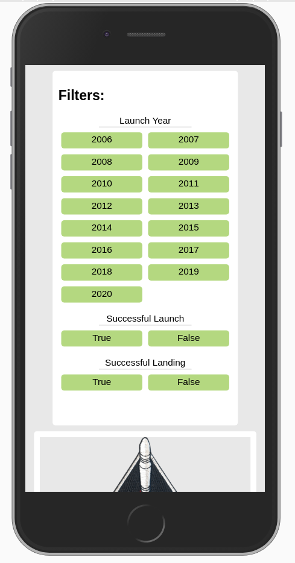
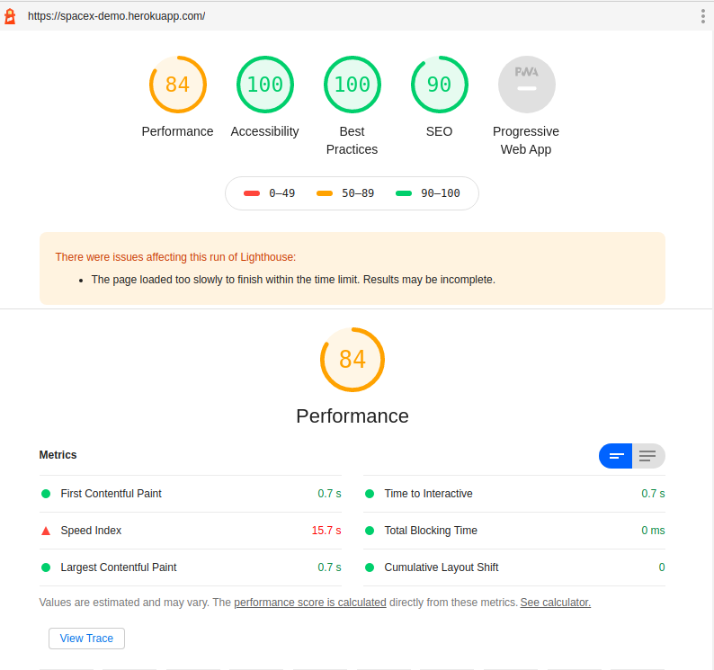

# Spacex
https://spacex-demo.herokuapp.com/
This project was generated with [Angular CLI](https://github.com/angular/angular-cli) version 10.0.6.

### HOW TO INSTALL & RUN ON LOCALLY

- After cloning the project , run `npm install`
- for running the project , run `ng serve`

### WHAT IT CONTAINS

- Listing of spacex launch programs cards 
- side filter for filter out programs by launch year, successful launch, successful landing
- Server side rendering of frontend application
- Full responsive design for mobile, tablet & desktop view
- Deployed on Heroku https://spacex-demo.herokuapp.com/
NOTE - Successful landing true/false parameter was not in api response so not shown in cards.

### APPLICATION SCREENSHOTS

##### DESKTOP VIEW

 

##### TABLET VIEW

 
##### MOBILE VIEW
 

### HEROKU APP LINK
https://spacex-demo.herokuapp.com/

### LIGHTHOUSE SCORE 
 